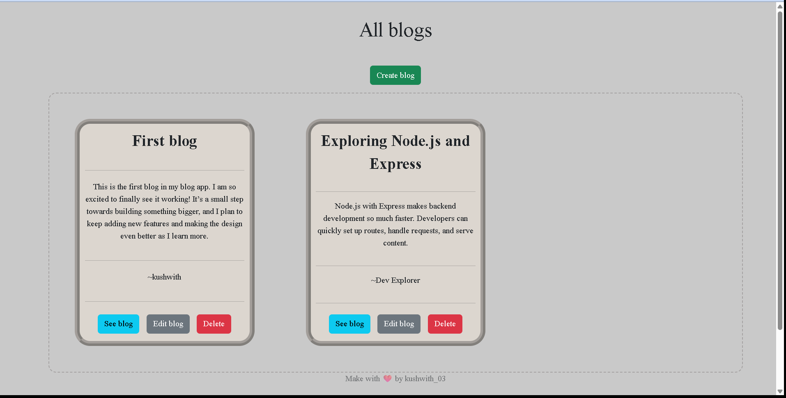

# Blog App 📝

A simple **Node.js + Express + EJS** blog application where users can create, view, edit, and delete blog posts.  
Built for learning and quick deployment on platforms like **Vercel**.

---
## 🚀 Live Website
[Click here to visit the live site](https://your-deployment-link.com)

---

## 👀 Preview


---


## 🚀 Features
- ✏️ **Create** new blog posts with title, content, and date.
- 📖 **Read** all blogs in a clean list view.
- 🛠 **Edit** blog content using method override (PATCH).
- ❌ **Delete** blogs (DELETE).
- 🎨 Simple and clean UI with customizable colors & fonts.
- 📅 Each blog automatically stores the creation date.

---

## 📂 Project Structure

```
blog-app/
│
├── api/ # Express app (Vercel serverless entry point)
│ └── index.js
├── views/ # EJS templates
│ ├── index.ejs
│ ├── new.ejs
│ ├── edit.ejs
│ ├── footer.ejs
│ └── show.ejs
├── public/ # Static files
│ └── style.css
├── package-lock.json
├── package.json
├── index.js # Local dev server entry point
└── vercel.json # Vercel config

```

---

## 🛠 Tech Stack
- **HTML5** – structure of the web pages
- **CSS3** – styling and layout
- **Node.js** – backend runtime
- **Express.js** – web framework
- **EJS** – server-side templates
- **Bootstrap** – quick styling
- **Method-Override** – to support PUT/PATCH/DELETE from forms

---

This project is part of my journey in learning web development.
I’m currently focusing on backend development to improve my skills and understanding of server-side technologies.
